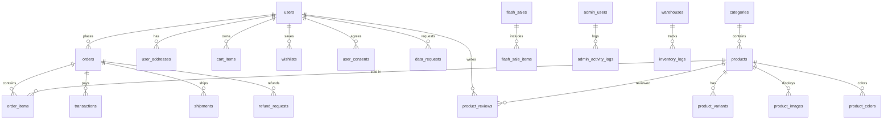

# Database Schema

TOAN Store sử dụng **MySQL 8.0** với **52+ bảng** (sau khi đã dọn dẹp các bảng cũ). Schema tự khởi tạo qua `src/lib/db/init.ts`.

---

## Entity Relationship Overview

---

## Core Tables

### `users`

| Column                | Type                                      | Description                                                   |
| --------------------- | ----------------------------------------- | ------------------------------------------------------------- |
| id                    | BIGINT PK                                 | Auto-increment                                                |
| email                 | VARCHAR(255) UNIQUE                       | Encrypted (AES-256-GCM)                                       |
| password              | VARCHAR(255) NULL                         | Bcrypt hash (NULL for OAuth)                                  |
| first_name            | VARCHAR(100)                              | —                                                             |
| last_name             | VARCHAR(100)                              | —                                                             |
| phone                 | VARCHAR(50)                               | Encrypted                                                     |
| date_of_birth         | DATE                                      | —                                                             |
| gender                | ENUM('male','female','other')             | —                                                             |
| google_id             | VARCHAR(255) UNIQUE NULL                  | OAuth Google                                                  |
| facebook_id           | VARCHAR(255) UNIQUE NULL                  | OAuth Facebook                                                |
| avatar_url            | VARCHAR(1000) NULL                        | —                                                             |
| available_points      | INT DEFAULT 0                             | Điểm hiện có. Ràng buộc `available_points <= lifetime_points` |
| lifetime_points       | INT DEFAULT 0                             | Tổng điểm tích lũy trọn đời                                   |
| membership_tier       | ENUM('bronze','silver','gold','platinum') | Auto-calculated                                               |
| is_active             | TINYINT(1) DEFAULT 1                      | —                                                             |
| is_verified           | TINYINT(1) DEFAULT 0                      | Email verified                                                |
| is_banned             | TINYINT(1) DEFAULT 0                      | Ban status                                                    |
| failed_login_attempts | INT DEFAULT 0                             | Anti-brute-force                                              |
| locked_until          | TIMESTAMP NULL                            | Account lockout                                               |
| token_version         | INT DEFAULT 1                             | Remote logout logic                                           |
| two_factor_enabled    | TINYINT(1) DEFAULT 0                      | 2FA Status (Standard: 0)                                      |
| created_at            | TIMESTAMP                                 | —                                                             |
| updated_at            | TIMESTAMP                                 | —                                                             |
| deleted_at            | TIMESTAMP NULL                            | Soft delete                                                   |

### `user_addresses`

| Column            | Type                 | Description            |
| ----------------- | -------------------- | ---------------------- |
| id                | BIGINT PK            | —                      |
| user_id           | BIGINT FK→users      | —                      |
| receiver_name     | VARCHAR(200)         | —                      |
| phone             | VARCHAR(50)          | Legacy (Masked \*\*\*) |
| phone_encrypted   | TEXT                 | AES-256-GCM Encrypted  |
| address_line      | TEXT                 | Legacy (Masked \*\*\*) |
| address_encrypted | TEXT                 | AES-256-GCM Encrypted  |
| city              | VARCHAR(100)         | —                      |
| is_default        | TINYINT(1) DEFAULT 0 | —                      |
| is_encrypted      | TINYINT(1) DEFAULT 1 | Has been migrated      |

### `admin_users`

| Column       | Type                 | Description                                 |
| ------------ | -------------------- | ------------------------------------------- |
| id           | BIGINT PK            | —                                           |
| email        | VARCHAR(255) UNIQUE  | —                                           |
| password     | VARCHAR(255)         | Bcrypt                                      |
| full_name    | VARCHAR(200)         | —                                           |
| bio          | TEXT NULL            | Tiểu sử tác giả (Author Profile)            |
| avatar_url   | VARCHAR(1000) NULL   | Ảnh đại diện tác giả                        |
| social_links | JSON NULL            | Liên kết mạng xã hội (Facebook, Twitter...) |
| role_id      | INT FK→roles         | Relational RBAC Role ID                     |
| is_active    | TINYINT(1) DEFAULT 1 | —                                           |
| last_login   | TIMESTAMP NULL       | —                                           |
| created_at   | TIMESTAMP            | —                                           |
| updated_at   | TIMESTAMP            | —                                           |
| deleted_at   | TIMESTAMP NULL       | Soft delete — giữ audit trail khi xóa admin |

---

## Product Tables

### `products`

| Column            | Type                                | Description                 |
| ----------------- | ----------------------------------- | --------------------------- |
| id                | BIGINT PK                           | —                           |
| name              | VARCHAR(500)                        | —                           |
| slug              | VARCHAR(600) UNIQUE                 | URL-friendly                |
| description       | TEXT                                | —                           |
| price_cache       | DECIMAL(12,2)                       | Base/Sale price             |
| msrp_price        | DECIMAL(12,2) NOT NULL              | Official retail price       |
| cost_price        | DECIMAL(12,2)                       | Internal cost price         |
| is_new_arrival    | TINYINT(1)                          | Badge "New Arrival"         |
| category_id       | BIGINT FK→categories                | —                           |
| gender            | ENUM('men','women','kids','unisex') | —                           |
| is_active         | TINYINT(1) DEFAULT 1                | —                           |
| stock_quantity    | INT DEFAULT 0                       | Total stock                 |
| reserved_quantity | INT DEFAULT 0                       | Reserved for pending orders |
| sold_count        | INT DEFAULT 0                       | —                           |
| views             | INT DEFAULT 0                       | Tổng lượt xem sản phẩm      |
| brand_id          | BIGINT FK→brands                    | Thương hiệu sản phẩm        |
| collection_id     | BIGINT FK→collections               | Bộ sưu tập sản phẩm         |
| sport_id          | BIGINT FK→sports                    | Phân loại theo môn thể thao |
| created_at        | TIMESTAMP                           | —                           |

### `product_variants`

| Column     | Type                     | Description                              |
| ---------- | ------------------------ | ---------------------------------------- |
| id         | BIGINT PK                | —                                        |
| product_id | BIGINT FK→products       | —                                        |
| size       | VARCHAR(20)              | e.g., "42", "M"                          |
| color_id   | BIGINT FK→product_colors | —                                        |
| sku        | VARCHAR(100) UNIQUE      | —                                        |
| price      | DECIMAL(12,2)            | Giá riêng cho biến thể (Source of Truth) |
| weight     | DECIMAL(10,3)            | Trọng lượng (kg)                         |

> [!NOTE]
> Các cột `stock_quantity` và `reserved_quantity` đã được loại bỏ hoàn toàn. Dữ liệu tồn kho hiện được quản lý tập trung tại bảng `inventory`.

---

## Order Tables

### `orders`

| Column               | Type                    | Description                               |
| -------------------- | ----------------------- | ----------------------------------------- |
| id                   | BIGINT PK               | —                                         |
| order_number         | VARCHAR(50) UNIQUE      | e.g., "TS-20260213-XXXXX"                 |
| user_id              | BIGINT FK→users         | —                                         |
| email                | VARCHAR(255)            | Legacy (Masked \*\*\*)                    |
| email_encrypted      | TEXT                    | AES-256-GCM Encrypted                     |
| phone                | VARCHAR(50)             | Legacy (Masked \*\*\*)                    |
| phone_encrypted      | TEXT                    | AES-256-GCM Encrypted                     |
| is_encrypted         | TINYINT(1) DEFAULT 1    | Has been migrated                         |
| status               | VARCHAR(50)             | State Machine status                      |
| total                | DECIMAL(12,2)           | Final amount paid                         |
| subtotal             | DECIMAL(12,2)           | Before discounts                          |
| discount             | DECIMAL(12,2) DEFAULT 0 | General/Membership discount               |
| shipping_fee         | DECIMAL(12,2) DEFAULT 0 | —                                         |
| tax                  | DECIMAL(12,2) DEFAULT 0 | VAT Tax amount (10%)                      |
| voucher_code         | VARCHAR(50) NULL        | Applied voucher                           |
| voucher_discount     | DECIMAL(12,2) DEFAULT 0 | —                                         |
| giftcard_number      | VARCHAR(100) NULL       | Legacy (Replaced by `giftcard_id`)        |
| giftcard_id          | BIGINT FK→gift_cards    | Link tới thẻ quà tặng đã dùng             |
| giftcard_discount    | DECIMAL(12,2) DEFAULT 0 | —                                         |
| tracking_number      | VARCHAR(100) NULL       | Shipping tracking                         |
| carrier              | VARCHAR(100) NULL       | Shipping carrier                          |
| notes                | TEXT NULL               | Customer notes                            |
| payment_confirmed_at | TIMESTAMP NULL          | —                                         |
| shipped_at           | TIMESTAMP NULL          | —                                         |
| delivered_at         | TIMESTAMP NULL          | —                                         |
| cancelled_at         | TIMESTAMP NULL          | Thời điểm đơn bị hủy (status → cancelled) |
| created_at           | TIMESTAMP               | —                                         |

---

## 📊 Analytics & Reporting

### `daily_metrics`

Thống kê hiệu năng và kinh doanh hàng ngày.

### `system_logs`

Lưu vết lỗi hệ thống tập trung.

---

## RBAC Tables (Auth)

### `roles` / `permissions` / `role_permissions`

Hệ thống Role-Based Access Control cho Admin.

---

## Indexes

Các index quan trọng:

- `users.email` — Unique index cho đăng nhập
- `products.slug` — Unique index cho URL
- `orders.order_number` — Unique index cho tra cứu
- `inventory.(product_variant_id, warehouse_id)` — UNIQUE constraint (Thay thế index trùng lặp đã bị xóa ở Phase 8)
- `admin_users.deleted_at` — Index cho filter soft-deleted admins

> [!NOTE]
> **Phase 8 — Index Optimization**: Index `idx_variant_warehouse` trên bảng `inventory` đã bị xóa vì trùng lặp hoàn toàn với `UNIQUE KEY unq_variant_warehouse`.

---

## Additional Tables

### `product_embeddings`

Lưu trữ AI vector embedding (JSON format). Xem khuyến nghị nâng cấp tại ghi chú bên dưới.

> [!WARNING]
> **AI Embedding Vector Strategy**: Hiện tại dùng `JSON` array. Khuyến nghị nâng cấp lên **MySQL 9+ VECTOR type** hoặc **Meilisearch Vector Search** để tối ưu hiệu năng tìm kiếm tương đồng (similarity search) khi catalog sản phẩm mở rộng.

### `security_logs`

Ghi nhận các sự kiện bảo mật (failed logins, rate limit hits).

> [!NOTE]
> **Rate Limiting**: Bảng `rate_limit_attempts` đã bị xóa khỏi schema. Toàn bộ rate limiting hiện chạy trên **Redis sliding window**.
