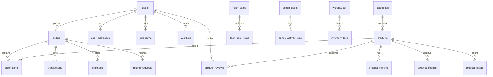

# Database Schema

Nike Clone sử dụng **MySQL 8.0** với 30+ bảng. Schema tự khởi tạo qua `src/lib/db/init.ts`.

---

## Entity Relationship Overview

---

## Core Tables

### `users`
| Column | Type | Description |
|--------|------|-------------|
| id | BIGINT PK | Auto-increment |
| email | VARCHAR(255) UNIQUE | Encrypted (AES-256-GCM) |
| password | VARCHAR(255) NULL | Bcrypt hash (NULL for OAuth) |
| first_name | VARCHAR(100) | — |
| last_name | VARCHAR(100) | — |
| phone | VARCHAR(50) | Encrypted |
| date_of_birth | DATE | — |
| gender | ENUM('male','female','other') | — |
| google_id | VARCHAR(255) UNIQUE NULL | OAuth Google |
| facebook_id | VARCHAR(255) UNIQUE NULL | OAuth Facebook |
| avatar_url | VARCHAR(1000) NULL | — |
| accumulated_points | INT DEFAULT 0 | Loyalty points |
| membership_tier | ENUM('bronze','silver','gold','platinum') | Auto-calculated |
| is_active | TINYINT(1) DEFAULT 1 | — |
| is_verified | TINYINT(1) DEFAULT 0 | Email verified |
| is_banned | TINYINT(1) DEFAULT 0 | Ban status |
| created_at | TIMESTAMP | — |
| updated_at | TIMESTAMP | — |
| deleted_at | TIMESTAMP NULL | Soft delete |

### `admin_users`
| Column | Type | Description |
|--------|------|-------------|
| id | BIGINT PK | — |
| email | VARCHAR(255) UNIQUE | — |
| password | VARCHAR(255) | Bcrypt |
| full_name | VARCHAR(200) | — |
| role | ENUM('admin','super_admin') | — |
| is_active | TINYINT(1) DEFAULT 1 | — |
| last_login | TIMESTAMP NULL | — |

---

## Product Tables

### `products`
| Column | Type | Description |
|--------|------|-------------|
| id | BIGINT PK | — |
| name | VARCHAR(500) | — |
| slug | VARCHAR(600) UNIQUE | URL-friendly |
| description | TEXT | — |
| price | DECIMAL(12,2) NOT NULL | — |
| original_price | DECIMAL(12,2) | Before discount |
| category_id | BIGINT FK→categories | — |
| gender | ENUM('men','women','kids','unisex') | — |
| is_active | TINYINT(1) DEFAULT 1 | — |
| stock_quantity | INT DEFAULT 0 | Total stock |
| reserved_quantity | INT DEFAULT 0 | Reserved for pending orders |
| sold_count | INT DEFAULT 0 | — |
| views | INT DEFAULT 0 | — |
| created_at | TIMESTAMP | — |

### `product_variants`
| Column | Type | Description |
|--------|------|-------------|
| id | BIGINT PK | — |
| product_id | BIGINT FK→products | — |
| size | VARCHAR(20) | e.g., "42", "M" |
| color_id | BIGINT FK→product_colors | — |
| stock_quantity | INT DEFAULT 0 | Per-variant stock |
| reserved_quantity | INT DEFAULT 0 | — |
| sku | VARCHAR(100) UNIQUE | — |

### `product_images`
| Column | Type | Description |
|--------|------|-------------|
| id | BIGINT PK | — |
| product_id | BIGINT FK→products | — |
| url | VARCHAR(1000) | — |
| is_main | TINYINT(1) DEFAULT 0 | Main display image |
| position | INT DEFAULT 0 | Sort order |

### `product_colors`
| Column | Type | Description |
|--------|------|-------------|
| id | BIGINT PK | — |
| product_id | BIGINT FK→products | — |
| name | VARCHAR(100) | Color name |
| hex_code | VARCHAR(7) | #RRGGBB |

### `categories`
| Column | Type | Description |
|--------|------|-------------|
| id | BIGINT PK | — |
| name | VARCHAR(200) | — |
| slug | VARCHAR(300) UNIQUE | — |
| parent_id | BIGINT NULL FK→categories | Nested categories |
| description | TEXT | — |
| is_active | TINYINT(1) DEFAULT 1 | — |

---

## Order Tables

### `orders`
| Column | Type | Description |
|--------|------|-------------|
| id | BIGINT PK | — |
| order_number | VARCHAR(50) UNIQUE | e.g., "NK-20260213-XXXXX" |
| user_id | BIGINT FK→users | — |
| status | VARCHAR(50) | State Machine status |
| total_price | DECIMAL(12,2) | — |
| subtotal | DECIMAL(12,2) | Before discounts |
| discount_amount | DECIMAL(12,2) DEFAULT 0 | — |
| shipping_fee | DECIMAL(12,2) DEFAULT 0 | — |
| email | VARCHAR(255) | Encrypted |
| phone | VARCHAR(50) | Encrypted |
| shipping_address_id | BIGINT FK→user_addresses | — |
| payment_method | VARCHAR(50) | cod, vnpay, momo |
| voucher_code | VARCHAR(50) NULL | Applied voucher |
| gift_card_id | BIGINT NULL | Applied gift card |
| gift_card_amount | DECIMAL(12,2) DEFAULT 0 | Amount deducted |
| tracking_number | VARCHAR(100) NULL | Shipping tracking |
| carrier | VARCHAR(100) NULL | Shipping carrier |
| notes | TEXT NULL | Customer notes |
| payment_confirmed_at | TIMESTAMP NULL | — |
| shipped_at | TIMESTAMP NULL | — |
| delivered_at | TIMESTAMP NULL | — |
| cancelled_at | TIMESTAMP NULL | — |
| created_at | TIMESTAMP | — |

### `order_items`
| Column | Type | Description |
|--------|------|-------------|
| id | BIGINT PK | — |
| order_id | BIGINT FK→orders | — |
| product_id | BIGINT FK→products | — |
| product_name | VARCHAR(500) | Snapshot at order time |
| unit_price | DECIMAL(12,2) | Price at order time |
| quantity | INT | — |
| total_price | DECIMAL(12,2) | — |
| size | VARCHAR(20) | — |

### `transactions`
| Column | Type | Description |
|--------|------|-------------|
| id | BIGINT PK | — |
| order_id | BIGINT FK→orders | — |
| payment_provider | VARCHAR(50) | vnpay, momo, cod |
| transaction_id | VARCHAR(255) | Provider's transaction ID |
| amount | DECIMAL(12,2) | — |
| status | VARCHAR(50) | pending, success, failed |
| response_data | JSON | Raw provider response |
| created_at | TIMESTAMP | — |

### `shipments`
| Column | Type | Description |
|--------|------|-------------|
| id | BIGINT PK | — |
| order_id | BIGINT FK→orders | — |
| tracking_number | VARCHAR(100) | — |
| carrier | VARCHAR(100) | — |
| status | VARCHAR(50) | — |
| estimated_delivery | DATE NULL | — |
| shipped_at | TIMESTAMP | — |

### `refund_requests`
| Column | Type | Description |
|--------|------|-------------|
| id | BIGINT PK | — |
| order_id | BIGINT FK→orders | — |
| user_id | BIGINT FK→users | — |
| reason | TEXT | — |
| status | VARCHAR(50) | pending, approved, rejected |
| amount | DECIMAL(12,2) | — |
| created_at | TIMESTAMP | — |

---

## Inventory Tables

### `inventory_logs`
| Column | Type | Description |
|--------|------|-------------|
| id | BIGINT PK | — |
| product_id | BIGINT FK→products | — |
| warehouse_id | BIGINT FK→warehouses NULL | — |
| quantity_change | INT | +/- |
| action | VARCHAR(50) | reserve, finalize, release, manual |
| reference_type | VARCHAR(50) | order, manual, flash_sale |
| reference_id | VARCHAR(100) | Order number etc. |
| notes | TEXT NULL | — |
| created_at | TIMESTAMP | — |

### `warehouses`
| Column | Type | Description |
|--------|------|-------------|
| id | BIGINT PK | — |
| name | VARCHAR(200) | — |
| address | TEXT | — |
| is_active | TINYINT(1) DEFAULT 1 | — |

---

## Marketing Tables

### `flash_sales` / `flash_sale_items`
Flash Sales với thời gian bắt đầu/kết thúc, giới hạn số lượng và giá khuyến mãi.

### `vouchers` / `coupons` / `promo_codes`
Hệ thống mã giảm giá đa tầng với giới hạn sử dụng, thời hạn, và điều kiện áp dụng.

### `gift_cards`
Thẻ quà tặng với số dư, PIN (Bcrypt hash), có thể áp dụng vào đơn hàng.

### `banners`
Banner quảng cáo với tracking click count.

### `newsletters`
Đăng ký nhận tin tức qua email.

---

## Support Tables

### `product_reviews`
Đánh giá sản phẩm với rating (1-5), tiêu đề, nội dung, trạng thái duyệt.

### `contact_submissions`
Form liên hệ từ khách hàng.

### `support_chats` / `support_messages`
Hệ thống chat support real-time.

### `admin_activity_logs`
Audit log cho mọi hành động admin.

### `settings`
Key-value store cho cài đặt hệ thống.

### `store_locations` / `store_hours`
Thông tin cửa hàng vật lý và giờ mở cửa.

---

## Indexes

Các index quan trọng:
- `users.email` — Unique index cho đăng nhập
- `products.slug` — Unique index cho URL
- `orders.order_number` — Unique index cho tra cứu
- `orders.user_id` — Index cho lấy danh sách đơn hàng
- `order_items.order_id` — Index cho chi tiết đơn
- `product_variants.(product_id, size, color_id)` — Composite index cho tồn kho
- `transactions.(order_id, payment_provider)` — Index cho IPN lookup
