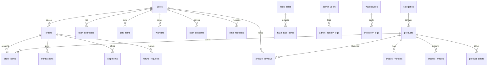

# Database Schema

TOAN Store sử dụng **MySQL 8.0** với **83 bảng**. Schema tự khởi tạo qua `src/lib/db/init.ts`.

---

## Entity Relationship Overview

---

## Core Tables

### `users`

| Column                | Type                                      | Description                  |
| --------------------- | ----------------------------------------- | ---------------------------- |
| id                    | BIGINT PK                                 | Auto-increment               |
| email                 | VARCHAR(255) UNIQUE                       | Encrypted (AES-256-GCM)      |
| password              | VARCHAR(255) NULL                         | Bcrypt hash (NULL for OAuth) |
| first_name            | VARCHAR(100)                              | —                            |
| last_name             | VARCHAR(100)                              | —                            |
| phone                 | VARCHAR(50)                               | Encrypted                    |
| date_of_birth         | DATE                                      | —                            |
| gender                | ENUM('male','female','other')             | —                            |
| google_id             | VARCHAR(255) UNIQUE NULL                  | OAuth Google                 |
| facebook_id           | VARCHAR(255) UNIQUE NULL                  | OAuth Facebook               |
| avatar_url            | VARCHAR(1000) NULL                        | —                            |
| accumulated_points    | INT DEFAULT 0                             | Loyalty points               |
| membership_tier       | ENUM('bronze','silver','gold','platinum') | Auto-calculated              |
| is_active             | TINYINT(1) DEFAULT 1                      | —                            |
| is_verified           | TINYINT(1) DEFAULT 0                      | Email verified               |
| is_banned             | TINYINT(1) DEFAULT 0                      | Ban status                   |
| failed_login_attempts | INT DEFAULT 0                             | Anti-brute-force             |
| locked_until          | TIMESTAMP NULL                            | Account lockout              |
| token_version         | INT DEFAULT 1                             | Remote logout logic          |
| two_factor_enabled    | TINYINT(1) DEFAULT 0                      | 2FA Status (Standard: 0)     |
| created_at            | TIMESTAMP                                 | —                            |
| updated_at            | TIMESTAMP                                 | —                            |
| deleted_at            | TIMESTAMP NULL                            | Soft delete                  |

### `user_addresses`

| Column            | Type                 | Description            |
| ----------------- | -------------------- | ---------------------- |
| id                | BIGINT PK            | —                      |
| user_id           | BIGINT FK→users      | —                      |
| receiver_name     | VARCHAR(200)         | —                      |
| phone             | VARCHAR(50)          | Legacy (Masked \*\*\*) |
| phone_encrypted   | TEXT                 | AES-256-GCM Encrypted  |
| address_line      | TEXT                 | Legacy (Masked \*\*\*) |
| address_encrypted | TEXT                 | AES-256-GCM Encrypted  |
| city              | VARCHAR(100)         | —                      |
| is_default        | TINYINT(1) DEFAULT 0 | —                      |
| is_encrypted      | TINYINT(1) DEFAULT 1 | Has been migrated      |

### `admin_users`

| Column       | Type                 | Description                      |
| ------------ | -------------------- | -------------------------------- |
| id           | BIGINT PK            | —                                |
| email        | VARCHAR(255) UNIQUE  | —                                |
| password     | VARCHAR(255)         | Bcrypt                           |
| full_name    | VARCHAR(200)         | —                                |
| bio          | TEXT NULL            | Tiểu sử tác giả (Author Profile) |
| avatar_url   | VARCHAR(1000) NULL   | Ảnh đại diện tác giả             |
| social_links | JSON NULL            | Liên kết mạng xã hội             |
| role_id      | INT FK→roles         | Relational RBAC Role ID          |
| is_active    | TINYINT(1) DEFAULT 1 | —                                |
| last_login   | TIMESTAMP NULL       | —                                |
| created_at   | TIMESTAMP            | —                                |
| updated_at   | TIMESTAMP            | —                                |

---

## Product Tables

### `products`

| Column            | Type                                | Description                 |
| ----------------- | ----------------------------------- | --------------------------- |
| id                | BIGINT PK                           | —                           |
| name              | VARCHAR(500)                        | —                           |
| slug              | VARCHAR(600) UNIQUE                 | URL-friendly                |
| description       | TEXT                                | —                           |
| base_price        | DECIMAL(12,2)                       | Base/Sale price             |
| retail_price      | DECIMAL(12,2) NOT NULL              | Official retail price       |
| cost_price        | DECIMAL(12,2)                       | Internal cost price         |
| is_new_arrival    | TINYINT(1)                          | Badge "New Arrival"         |
| category_id       | BIGINT FK→categories                | —                           |
| gender            | ENUM('men','women','kids','unisex') | —                           |
| is_active         | TINYINT(1) DEFAULT 1                | —                           |
| stock_quantity    | INT DEFAULT 0                       | Total stock                 |
| reserved_quantity | INT DEFAULT 0                       | Reserved for pending orders |
| sold_count        | INT DEFAULT 0                       | —                           |
| views             | INT DEFAULT 0                       | —                           |
| created_at        | TIMESTAMP                           | —                           |

### `product_variants`

| Column            | Type                     | Description       |
| ----------------- | ------------------------ | ----------------- |
| id                | BIGINT PK                | —                 |
| product_id        | BIGINT FK→products       | —                 |
| size              | VARCHAR(20)              | e.g., "42", "M"   |
| color_id          | BIGINT FK→product_colors | —                 |
| stock_quantity    | INT DEFAULT 0            | Per-variant stock |
| reserved_quantity | INT DEFAULT 0            | —                 |
| sku               | VARCHAR(100) UNIQUE      | —                 |

### `product_images`

| Column     | Type                 | Description        |
| ---------- | -------------------- | ------------------ |
| id         | BIGINT PK            | —                  |
| product_id | BIGINT FK→products   | —                  |
| url        | VARCHAR(1000)        | —                  |
| is_main    | TINYINT(1) DEFAULT 0 | Main display image |
| position   | INT DEFAULT 0        | Sort order         |

### `product_colors`

| Column     | Type               | Description |
| ---------- | ------------------ | ----------- |
| id         | BIGINT PK          | —           |
| product_id | BIGINT FK→products | —           |
| name       | VARCHAR(100)       | Color name  |
| hex_code   | VARCHAR(7)         | #RRGGBB     |

### `categories`

| Column      | Type                      | Description                   |
| ----------- | ------------------------- | ----------------------------- |
| id          | BIGINT PK                 | —                             |
| name        | VARCHAR(200)              | —                             |
| slug        | VARCHAR(300) UNIQUE       | —                             |
| parent_id   | BIGINT NULL FK→categories | Nested categories             |
| description | TEXT                      | —                             |
| position    | INT DEFAULT 0             | Thứ tự hiển thị (Drag & Drop) |
| is_active   | TINYINT(1) DEFAULT 1      | —                             |

---

## Order Tables

### `orders`

| Column               | Type                    | Description                 |
| -------------------- | ----------------------- | --------------------------- |
| id                   | BIGINT PK               | —                           |
| order_number         | VARCHAR(50) UNIQUE      | e.g., "TS-20260213-XXXXX"   |
| user_id              | BIGINT FK→users         | —                           |
| email                | VARCHAR(255)            | Legacy (Masked \*\*\*)      |
| email_encrypted      | TEXT                    | AES-256-GCM Encrypted       |
| phone                | VARCHAR(50)             | Legacy (Masked \*\*\*)      |
| phone_encrypted      | TEXT                    | AES-256-GCM Encrypted       |
| is_encrypted         | TINYINT(1) DEFAULT 1    | Has been migrated           |
| status               | VARCHAR(50)             | State Machine status        |
| total                | DECIMAL(12,2)           | Final amount paid           |
| subtotal             | DECIMAL(12,2)           | Before discounts            |
| discount             | DECIMAL(12,2) DEFAULT 0 | General/Membership discount |
| shipping_fee         | DECIMAL(12,2) DEFAULT 0 | —                           |
| tax                  | DECIMAL(12,2) DEFAULT 0 | VAT Tax amount (10%)        |
| voucher_code         | VARCHAR(50) NULL        | Applied voucher             |
| voucher_discount     | DECIMAL(12,2) DEFAULT 0 | —                           |
| giftcard_number      | VARCHAR(100) NULL       | —                           |
| giftcard_discount    | DECIMAL(12,2) DEFAULT 0 | —                           |
| tracking_number      | VARCHAR(100) NULL       | Shipping tracking           |
| carrier              | VARCHAR(100) NULL       | Shipping carrier            |
| notes                | TEXT NULL               | Customer notes              |
| payment_confirmed_at | TIMESTAMP NULL          | —                           |
| shipped_at           | TIMESTAMP NULL          | —                           |
| delivered_at         | TIMESTAMP NULL          | —                           |
| cancelled_at         | TIMESTAMP NULL          | —                           |
| created_at           | TIMESTAMP               | —                           |

### `order_items`

| Column       | Type               | Description            |
| ------------ | ------------------ | ---------------------- |
| id           | BIGINT PK          | —                      |
| order_id     | BIGINT FK→orders   | —                      |
| product_id   | BIGINT FK→products | —                      |
| product_name | VARCHAR(500)       | Snapshot at order time |
| unit_price   | DECIMAL(12,2)      | Price at order time    |
| quantity     | INT                | —                      |
| total_price  | DECIMAL(12,2)      | —                      |
| size         | VARCHAR(20)        | —                      |

### `transactions`

| Column           | Type             | Description               |
| ---------------- | ---------------- | ------------------------- |
| id               | BIGINT PK        | —                         |
| order_id         | BIGINT FK→orders | —                         |
| payment_provider | VARCHAR(50)      | vnpay, momo, cod          |
| transaction_id   | VARCHAR(255)     | Provider's transaction ID |
| amount           | DECIMAL(12,2)    | —                         |
| status           | VARCHAR(50)      | pending, success, failed  |
| response_data    | JSON             | Raw provider response     |
| created_at       | TIMESTAMP        | —                         |

### `shipments`

| Column             | Type             | Description |
| ------------------ | ---------------- | ----------- |
| id                 | BIGINT PK        | —           |
| order_id           | BIGINT FK→orders | —           |
| tracking_number    | VARCHAR(100)     | —           |
| carrier            | VARCHAR(100)     | —           |
| status             | VARCHAR(50)      | —           |
| estimated_delivery | DATE NULL        | —           |
| shipped_at         | TIMESTAMP        | —           |

### `refund_requests`

| Column     | Type             | Description                 |
| ---------- | ---------------- | --------------------------- |
| id         | BIGINT PK        | —                           |
| order_id   | BIGINT FK→orders | —                           |
| user_id    | BIGINT FK→users  | —                           |
| reason     | TEXT             | —                           |
| status     | VARCHAR(50)      | pending, approved, rejected |
| amount     | DECIMAL(12,2)    | —                           |
| created_at | TIMESTAMP        | —                           |

---

## Inventory Tables

### `inventory_logs`

| Column          | Type                      | Description                        |
| --------------- | ------------------------- | ---------------------------------- |
| id              | BIGINT PK                 | —                                  |
| product_id      | BIGINT FK→products        | —                                  |
| warehouse_id    | BIGINT FK→warehouses NULL | —                                  |
| quantity_change | INT                       | +/-                                |
| action          | VARCHAR(50)               | reserve, finalize, release, manual |
| reference_type  | VARCHAR(50)               | order, manual, flash_sale          |
| reference_id    | VARCHAR(100)              | Order number etc.                  |
| notes           | TEXT NULL                 | —                                  |
| created_at      | TIMESTAMP                 | —                                  |

### `warehouses`

| Column    | Type                 | Description |
| --------- | -------------------- | ----------- |
| id        | BIGINT PK            | —           |
| name      | VARCHAR(200)         | —           |
| address   | TEXT                 | —           |
| is_active | TINYINT(1) DEFAULT 1 | —           |

### `inventory_transfers`

| Column             | Type        | Description        |
| ------------------ | ----------- | ------------------ |
| from_warehouse_id  | BIGINT      | —                  |
| to_warehouse_id    | BIGINT      | —                  |
| product_variant_id | BIGINT      | —                  |
| quantity           | INT         | —                  |
| status             | VARCHAR(50) | pending, completed |

---

## Marketing Tables

### `flash_sales` / `flash_sale_items`

Flash Sales với thời gian bắt đầu/kết thúc, giới hạn số lượng và giá khuyến mãi.

### `vouchers` / `coupons` / `promo_codes`

Hệ thống mã giảm giá đa tầng với giới hạn sử dụng, thời hạn, và điều kiện áp dụng.

### `gift_cards`

Thẻ quà tặng với số dư, PIN (Bcrypt hash), có thể áp dụng vào đơn hàng.

### `gift_card_lockouts`

| Column          | Type         | Description                   |
| --------------- | ------------ | ----------------------------- |
| ip_address      | VARCHAR(45)  | Anti-Brute-Force lock on IP   |
| card_number     | VARCHAR(100) | Anti-Brute-Force lock on Card |
| failed_attempts | INT          | —                             |
| locked_until    | TIMESTAMP    | —                             |

### `banners`

Banner quảng cáo với tracking click count.

### `newsletters`

Đăng ký nhận tin tức qua email (`newsletter_subscriptions`).

---

## 📊 Analytics & Reporting

### `daily_metrics`

Thống kê hiệu năng và kinh doanh hàng ngày.

### `search_analytics`

| Column             | Type         | Description          |
| ------------------ | ------------ | -------------------- |
| query              | VARCHAR(255) | Search query         |
| results_count      | INT          | —                    |
| processing_time_ms | INT          | performance tracking |
| user_id            | BIGINT NULL  | —                    |
| ip_address         | VARCHAR(45)  | —                    |

### `point_transactions`

Lịch sử biến động điểm thưởng.
| Column | Type | Description |
|--------|------|-------------|
| user_id | BIGINT | — |
| points | INT | +/- |
| type | ENUM | earn, spend, expire |
| description | TEXT | — |

### `system_logs`

Lưu vết lỗi hệ thống tập trung.
| Column | Type | Description |
|--------|------|-------------|
| level | ENUM | error, warn, info |
| message | TEXT | — |
| stack | TEXT | Stack trace |
| path | VARCHAR(255) | Endpoint/File |

---

## GDPR & Privacy Compliance Tables

### `user_consents`

| Column     | Type            | Description           |
| ---------- | --------------- | --------------------- |
| id         | BIGINT PK       | —                     |
| user_id    | BIGINT FK→users | —                     |
| purpose    | VARCHAR(100)    | marketing, analytics  |
| is_granted | TINYINT(1)      | Bật/Tắt               |
| ip_address | VARCHAR(45)     | Lưu vết IP lúc đồng ý |
| granted_at | TIMESTAMP       | —                     |

### `cookie_consents`

| Column      | Type                 | Description                           |
| ----------- | -------------------- | ------------------------------------- |
| id          | BIGINT PK            | —                                     |
| session_id  | VARCHAR(255)         | Phiên ẩn danh                         |
| user_id     | BIGINT FK→users NULL | Khi khách đã đăng nhập                |
| preferences | JSON                 | { essential: true, analytics: false } |
| updated_at  | TIMESTAMP            | —                                     |

### `data_requests`

Quản lý yêu cầu (Right to Access, Right to be Forgotten)
| Column | Type | Description |
|--------|------|-------------|
| id | BIGINT PK | — |
| user_id | BIGINT FK→users | Người yêu cầu |
| request_type | ENUM('export','delete') | — |
| status | VARCHAR(50) | pending, processing, completed |
| created_at | TIMESTAMP | — |

---

## Support Tables

### `product_reviews`

Đánh giá sản phẩm với rating (1-5), tiêu đề, nội dung, trạng thái duyệt.

### `contact_submissions`

Form liên hệ từ khách hàng (`contact_messages`).

### `news` / `news_comments` / `news_comment_likes`

Hệ thống Tin tức & Blog với bình luận lồng nhau.
| Table | Purpose |
|-------|---------|
| `news` | Bài viết news/blog (`author_id` FK→admin_users) |
| `news_comments` | Bình luận (support parent_id cho nested) |
| `news_comment_likes` | Theo dõi lượt thích bình luận |

### `support_chats` / `support_messages`

Hệ thống chat support real-time.

### `notifications`

Hệ thống thông báo nội bộ (In-app Notifications).
| Column | Type | Description |
|--------|------|-------------|
| id | BIGINT PK | — |
| user_id | BIGINT FK→users | — |
| type | ENUM | 'order', 'social', 'promo', 'system' |
| title | VARCHAR(255) | Tiêu đề thông báo |
| message | TEXT | Nội dung chi tiết |
| link | VARCHAR(255) | Đường dẫn điều hướng (Deep-link) |
| is_read | TINYINT(1) | Trạng thái đã đọc |
| created_at | TIMESTAMP | — |

### `admin_audit_logs`

Audit log cho mọi hành động admin nhạy cảm.

| Column      | Type         | Description                           |
| ----------- | ------------ | ------------------------------------- |
| id          | INT PK       | —                                     |
| admin_id    | INT FK       | ID của admin thực hiện                |
| action      | VARCHAR(255) | Hành động (e.g., UPDATE_ORDER_STATUS) |
| target_type | VARCHAR(50)  | Loại đối tượng (e.g., order, product) |
| target_id   | VARCHAR(100) | ID của đối tượng bị tác động          |
| details     | JSON         | Thông tin chi tiết thay đổi (old/new) |
| ip_address  | VARCHAR(45)  | IP thực hiện hành động                |
| created_at  | TIMESTAMP    | —                                     |

### `settings`

Key-value store cho cài đặt hệ thống.

### `daily_metrics`

Thống kê hiệu năng và kinh doanh hàng ngày.

| Column        | Type          | Description              |
| ------------- | ------------- | ------------------------ |
| id            | INT PK        | —                        |
| date          | DATE UNIQUE   | Ngày thống kê            |
| total_orders  | INT           | Tổng đơn hàng trong ngày |
| total_revenue | DECIMAL(15,2) | Tổng doanh thu           |
| active_users  | INT           | Số người dùng hoạt động  |
| created_at    | TIMESTAMP     | —                        |

---

## RBAC Tables (Auth)

### `roles`

| Column      | Type               | Description                  |
| ----------- | ------------------ | ---------------------------- |
| id          | INT PK             | —                            |
| name        | VARCHAR(50) UNIQUE | e.g., 'super_admin', 'staff' |
| description | TEXT               | —                            |

### `permissions`

| Column      | Type                | Description              |
| ----------- | ------------------- | ------------------------ |
| id          | INT PK              | —                        |
| name        | VARCHAR(100) UNIQUE | e.g., 'manage:inventory' |
| description | TEXT                | —                        |

### `role_permissions`

| Column        | Type               | Description |
| ------------- | ------------------ | ----------- |
| role_id       | INT FK→roles       | —           |
| permission_id | INT FK→permissions | —           |

---

## Indexes

Các index quan trọng:

- `users.email` — Unique index cho đăng nhập
- `products.slug` — Unique index cho URL
- `orders.order_number` — Unique index cho tra cứu
- `orders.user_id` — Index cho lấy danh sách đơn hàng
- `order_items.order_id` — Index cho chi tiết đơn
- `product_variants.(product_id, size, color_id)` — Composite index cho tồn kho
- `transactions.(order_id, payment_provider)` — Index cho IPN lookup
- `admin_activity_logs.(entity_type, entity_id, created_at DESC)` — Composite index cho audit timeline
- `inventory.(warehouse_id, quantity)` — Composite index cho stock lookups
- `inventory.(product_variant_id, warehouse_id)` — Composite index cho variant-warehouse

---

## Additional Tables

### `review_media`

Ảnh/video đính kèm đánh giá sản phẩm.
| Column | Type | Description |
|--------|------|-------------|
| id | BIGINT PK | — |
| review_id | BIGINT FK→product_reviews | — |
| media_type | VARCHAR(20) | image, video |
| media_url | VARCHAR(1000) | URL file |
| thumbnail_url | VARCHAR(1000) | Thumbnail |
| file_size | INT | Bytes |
| position | INT DEFAULT 0 | Thứ tự hiển thị |

### `security_logs`

Ghi nhận các sự kiện bảo mật (failed logins, rate limit hits).
| Column | Type | Description |
|--------|------|-------------|
| id | BIGINT PK | — |
| event_type | VARCHAR(100) | login_failed, rate_limited, etc. |
| ip_address | VARCHAR(45) | — |
| user_agent | TEXT | — |
| details | JSON | Chi tiết sự kiện |
| created_at | TIMESTAMP | — |

### `seo_metadata`

Dữ liệu SEO cho các trang tĩnh và dynamic routes.
| Column | Type | Description |
|--------|------|-------------|
| id | BIGINT PK | — |
| page_path | VARCHAR(255) UNIQUE | URL path |
| title | VARCHAR(255) | Meta title |
| description | TEXT | Meta description |
| og_image | VARCHAR(1000) | Open Graph image |
| keywords | TEXT | Meta keywords |
| updated_at | TIMESTAMP | — |

### `refunds`

Bảng lưu trữ thông tin hoàn tiền đã xử lý.
| Column | Type | Description |
|--------|------|-------------|
| id | BIGINT PK | — |
| order_id | BIGINT FK→orders | — |
| amount | DECIMAL(12,2) | Số tiền hoàn |
| reason | TEXT | Lý do hoàn tiền |
| status | VARCHAR(50) | pending, completed, rejected |
| processed_by | BIGINT FK→admin_users | Admin xử lý |
| created_at | TIMESTAMP | — |
